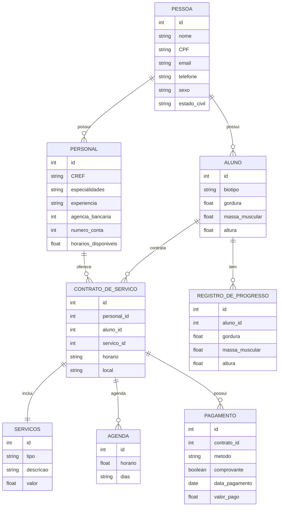

# 📊 Documento de Análise de Pontos de Função (APF)

## 1. Objetivo

Este documento apresenta a análise de pontos de função (APF) do sistema de gestão para personal trainers, com base no modelo de dados e funcionalidades descritas. A APF é utilizada para estimar o **tamanho funcional** do sistema, servindo de base para estimativas de esforço, custo e prazo.

---

## 2. Métodos Utilizados

Foram adotadas as abordagens:

- **Contagem Indicativa (Ci):** considera apenas as **Funções de Dados**.
- **Contagem Detalhada (Cd):** considera **Funções de Dados** e **Funções de Transação**.

---

### Modelo de dados (Entidade-Relacionamento)

## 3. Contagem Indicativa (Ci)

| Função de Dado     | Tipo | Entidades Relacionadas           | Tamanho em PF |
|--------------------|------|----------------------------------|:-------------:|
| Pessoa             | ALI  | Pessoa                           | 35 PF         |
| Personal           | ALI  | Personal + Pessoa (com herança)  | 35 PF         |
| Aluno              | ALI  | Aluno + Pessoa (com herança)     | 35 PF         |
| Serviços           | ALI  | Servicos                         | 35 PF         |
| Agenda             | ALI  | Agenda                           | 35 PF         |
| Contrato de Serviço| ALI  | Contrato + relacionamentos       | 35 PF         |
| Pagamento          | ALI  | Pagamento                        | 35 PF         |
| Registro de Progresso | ALI | Registro_de_Progresso         | 35 PF         |
| Endereço           | AIE  | Endereço                         | 15 PF         |
| Serviços de Contrato | AIE| Servicos_de_Contrato            | 15 PF         |
| **Total**          |      |                                  | **340 PF**    |

---

## 4. Contagem Detalhada (Cd)

### 4.1 Funções de Dados

| Função de Dado     | Tipo | RLR | DER | Complexidade | PF |
|--------------------|------|-----|-----|---------------|----|
| Pessoa             | ALI  | 1   | 9   | Baixa         | 7  |
| Aluno              | ALI  | 1   | 15  | Média         | 10 |
| Personal           | ALI  | 1   | 11  | Média         | 10 |
| Serviços           | ALI  | 1   | 4   | Baixa         | 7  |
| Agenda             | ALI  | 1   | 3   | Baixa         | 7  |
| Contrato de Serviço| ALI  | 3   | 6   | Média         | 10 |
| Pagamento          | ALI  | 1   | 6   | Baixa         | 7  |
| Registro de Progresso | ALI| 1   | 10  | Média         | 10 |
| Endereço           | AIE  | 1   | 8   | Média         | 7  |
| Serviços de Contrato | AIE| 1   | 2   | Baixa         | 5  |
| **Subtotal**       |      |     |     |               | **80 PF** |

---

### 4.2 Funções de Transação

| Descrição                  | Tipo | ALR | DER | Complexidade | PF |
|---------------------------|------|-----|-----|---------------|----|
| Inserir Pessoa            | EE   | 1   | 8   | Baixa         | 3  |
| Atualizar Pessoa          | EE   | 1   | 8   | Baixa         | 3  |
| Consultar Pessoa          | CE   | 1   | 8   | Baixa         | 3  |
| Inserir Aluno             | EE   | 2   | 10  | Média         | 4  |
| Atualizar Aluno           | EE   | 2   | 10  | Média         | 4  |
| Consultar Aluno           | CE   | 2   | 10  | Média         | 4  |
| Inserir Personal          | EE   | 2   | 8   | Média         | 4  |
| Atualizar Personal        | EE   | 2   | 8   | Média         | 4  |
| Consultar Personal        | CE   | 2   | 8   | Média         | 4  |
| Inserir Serviço           | EE   | 1   | 3   | Baixa         | 3  |
| Atualizar Serviço         | EE   | 1   | 3   | Baixa         | 3  |
| Consultar Serviço         | CE   | 1   | 3   | Baixa         | 3  |
| Agendar Horário           | EE   | 1   | 2   | Baixa         | 3  |
| Inserir Contrato          | EE   | 4   | 6   | Alta          | 6  |
| Consultar Contrato        | CE   | 3   | 6   | Média         | 4  |
| Registrar Pagamento       | EE   | 1   | 5   | Baixa         | 3  |
| Consultar Pagamento       | CE   | 1   | 5   | Baixa         | 3  |
| Inserir Registro de Progresso | EE| 1   | 8   | Média         | 4  |
| Consultar Progresso       | CE   | 1   | 8   | Média         | 4  |
| **Subtotal**              |      |     |     |               | **70 PF** |

---

## 5. Resumo da Análise

| Tipo de Contagem     | Pontos de Função |
|----------------------|------------------|
| Contagem Indicativa  | **340 PF**       |
| Contagem Detalhada   | **150 PF**       |

---

## 6. Observações

- A contagem detalhada reflete melhor o esforço de desenvolvimento e pode ser usada em estimativas de prazo/custo.
- Valores podem variar conforme a análise de RLR/DER mais minuciosa por parte do time de requisitos.
EOF
