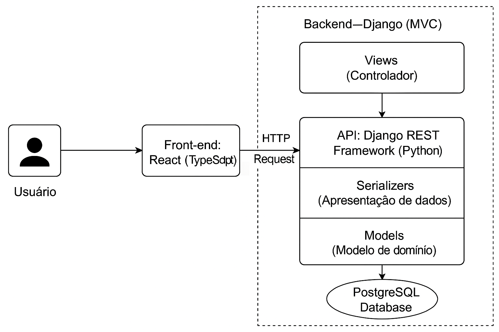

# Projeto Arquitetural do Software

Documento construído a partido do **Modelo BSI - Doc 005 - Documento de Projeto Arquitetual do Software** que pode ser encontrado no
link:https://docs.google.com/document/d/1i80vPaInPi5lSpI7rk4QExnO86iEmrsHBfmYRy6RDSM/edit?usp=sharing

## Descrição da Arquitetura do Projeto

A arquitetura do projeto segue um **modelo monolítico** baseado no **Django Framework** para o backend e **React com TypeScript** para o frontend. O sistema é estruturado como uma aplicação cliente-servidor que utiliza APIs REST para a comunicação entre o frontend e o backend.  

**Estrutura Geral:**  
- **Frontend:** Implementado com **React e TypeScript**, responsável por consumir as APIs REST e fornecer a interface do usuário.  
- **Backend:** Construído em **Django**, utilizando um padrão **MVC (Model-View-Controller)**, com **Serializers do Django Rest Framework (DRF)** para transformar os dados em JSON.  
- **Banco de Dados:** Suporte para **PostgreSQL**, utilizando o **ORM do Django** para abstração do banco.  
- **Serviços:** Camada intermediária que centraliza a lógica de negócio e orquestra a comunicação entre as views e o ORM.  

**Cloud e Infraestrutura:**  
   - Até o momento está sendo hospedado no serviço gratuito **Render** a API e a DataBase e no **Vercel** para o front.

**Conexão com outros módulos e sistemas:**  
   - A API REST pode ser consumida por diferentes clientes, incluindo aplicações web e móveis.  
   - Possível integração com sistemas externos via **APIs de terceiros, webhooks ou mensagens assíncronas** (ex: RabbitMQ, Kafka).  

A estrutura do projeto permite futuras migrações para um modelo **baseado em microsserviços**, caso haja necessidade de modularização e escalabilidade mais granular.  

## Visão Geral da Arquitetura

Imagem com a organização geral dos componentes da arquitetura do projeto. Segue um exemplo da **Arquitetura Geral** de um Projeto usando **Django Framework** Integrado a um Frontend com **React e TypeScript**:

## Requisitos Não-Funcionais  

| **Requisito**        | **Detalhes** |
|----------------------|-------------|
| **Desempenho**       | 1. As páginas devem ter um carregamento rápido sem causar lentidão ao usuário.  2. Consultas ao banco de dados devem responder em até **1 segundo**.  3. O sistema deve suportar múltiplas conexões simultâneas sem perda significativa de desempenho. |
| **Interoperabilidade** | 1. O sistema deve rodar em **Linux** e ser distribuído via **Docker**.  2. O banco de dados será **PostgreSQL 16**|
| **Escalabilidade**   | 1. O sistema deve permitir expansão para suportar mais usuários quando necessário.  2. O backend deve permitir a adição de novos serviços sem grandes mudanças na arquitetura. |
| **Disponibilidade**  | 1. O sistema deve ficar disponível **99% do tempo**, com possíveis manutenções agendadas.  2. Deve haver um **backup periódico** dos dados. |
| **Usabilidade**      | 1. O frontend deve ser **responsivo**, funcionando bem em celulares, tablets e desktops.  2. A interface deve ser intuitiva e de fácil navegação. |
| **Segurança**        | 1. O sistema deve utilizar **HTTPS** para comunicação segura.  2. Implementação de um sistema de **autenticação segura** com usuários e senhas criptografadas. |
| **Manutenção**       | 1. Atualizações e correções devem ser feitas sem impacto significativo para os usuários.  2. O código deve ser organizado para facilitar futuras modificações. |

## Mecanismos Arquiteturais  

Nesta seção, listamos os principais mecanismos arquiteturais do sistema para garantir uma implementação viável dentro do contexto acadêmico.  

| **Mecanismo de Análise** | **Mecanismo de Design**         | **Mecanismo de Implementação**    |
|-------------------------|--------------------------------|----------------------------------|
| **Persistência**       | Banco de dados relacional      | PostgreSQL 16 |
| **Camada de Dados**    | Mapeamento OR                  | Django ORM |
| **Frontend**          | Interface do Usuário           | React com TypeScript|
| **Backend**           | API REST                       | Django REST Framework (DRF) |
| **Autenticação**      | Login com senha                | Django Authentication padrão |
| **Build**            | Execução local                  | Ambiente virtual com venv (Python) |
| **Deploy**           | Hospedagem simples              | Render para a API e DataBase e Vercel para o front |
| **Infraestrutura**   | Ambiente de desenvolvimento     |  |

## Implantação  

O sistema será implantado de forma simples, utilizando um serviço de hospedagem gratuita ou rodando localmente no ambiente de desenvolvimento.  

### **1. Ambiente de Desenvolvimento**  
- O backend será executado usando **Django** com um servidor local (`python manage.py runserver`).  
- O frontend será rodado com **React** via Vite (`npm run dev`).  
- Banco de dados pode ser **PostgreSQL**.

### **2. Ambiente de Produção (Hospedagem Simples)**  
- O backend será hospedado na plataforma **Render**  
- O frontend será hospedado no **Vercel**.  
- O banco de dados está sendo hospedado no **Render** no momento, porém devido sua data de validade o mesmo deverá mudar

### **Fluxo de Deploy**  
1. O código será versionado no **GitHub**.  
2. Quando houver mudanças, o código será enviado para a hospedagem (exemplo: Render para o backend e Vercel para o frontend).  
3. O banco de dados será configurado para manter os dados armazenados entre as execuções.  

# Referências  

- Django Software Foundation. **Django Documentation**. Disponível em: [https://docs.djangoproject.com/en/stable/](https://docs.djangoproject.com/en/stable/). Acesso em: 31 mar. 2025.  

- TypeScript Handbook. **TypeScript Documentation**. Disponível em: [https://www.typescriptlang.org/docs/](https://www.typescriptlang.org/docs/). Acesso em: 31 mar. 2025.  

- PostgreSQL Global Development Group. **PostgreSQL 16 Documentation**. Disponível em: [https://www.postgresql.org/docs/16/](https://www.postgresql.org/docs/16/). Acesso em: 31 mar. 2025.  

- Netlify. **Deploy React Apps with Netlify**. Disponível em: [https://docs.netlify.com/](https://docs.netlify.com/). Acesso em: 31 mar. 2025.  

- Render. **Deploying Django Applications**. Disponível em: [https://render.com/docs/deploy-django](https://render.com/docs/deploy-django). Acesso em: 31 mar. 2025.  

