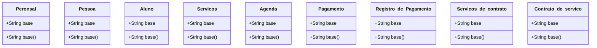

# Documento de Modelos

Modelo conceitual UML e modelo entidade-relacionamento

## Modelo Conceitual

### Diagrama de Classe

      

### Descrição das Entidades

Descrição breve das entidades que o sistema contém.

| Entidade | Descrição   |
|----------|------------------------------------------------------------------------------------------------------------------------------------------------------|
| Personal   | O sistema deverá exigir a entrada, e realizar quando necessário a
consulta, edição, exclusão lógica e física dos dados. |

| Aluno     | O sistema deverá exigir a entrada, e realizar quando necessário a edição,
exclusão lógica e física, dos dados. |

| Pessoa     | Entidade aux.  |

| Servico   | O sistema deverá cadastrar alguns tipos de serviços/pacotes que estarão
pré-preparados para a melhor negociação entre personal e aluno.   |

| Agenda   | Permitir que o personal cadastre no sistema horários disponíveis para
agendamentos de serviços.  |

| Gerar Pagamento   | Capacidade de manter relatórios de pagamentos realizados.       |

| Registro_de_progresso   | Permitir o acompanhamento do progresso dos alunos ao longo do tempo,
registrando medidas corporais, resultados de testes de aptidão física e desempenho
em exercícios. |

| Servicos_de_contrato   | Entidade aux. |

| Contrato_de_servico   | Capacidade de marcar e gerenciar as sessões de treinamento com os
clientes ao longo do tempo.     |

### Modelo de dados (Entidade-Relacionamento)

|   Tabela   | Laboratório |
| ---------- | ----------- |
| Descrição  | Armazena as informações daquela classe. |

|  Nome         | Descrição                        | Tipo de Dado | Tamanho | Restrições de Domínio |
| ------------- | -------------------------------- | ------------ | ------- | --------------------- |
| base        | identificador gerado pelo SGBD   | SERIAL       | ---     | PK / Identity |
| base         | representação em sigla do lab    | VARCHAR      | 15      | Unique / Not Null |
| base          | nome do laboratório              | VARCHAR      | 150     | Not Null |
| base     | detalhes sobre o laboratório     | VARCHAR      | 250     | --- |