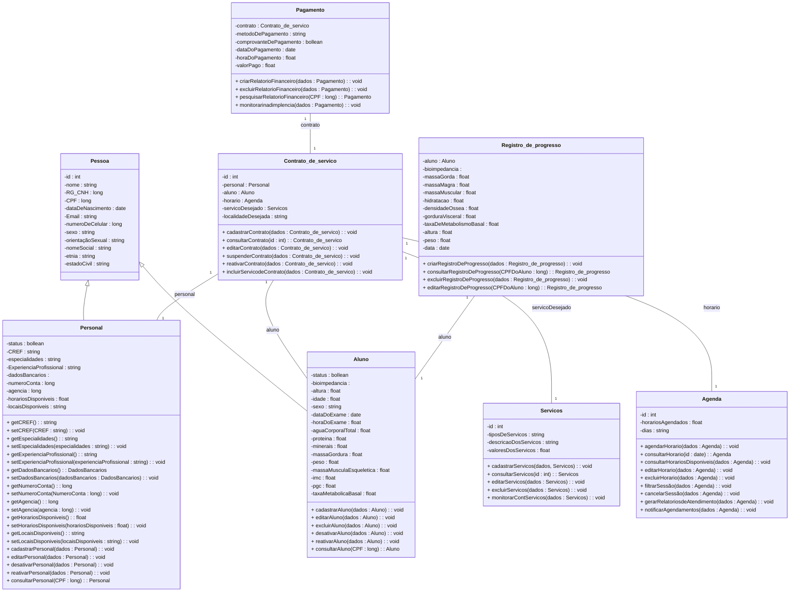
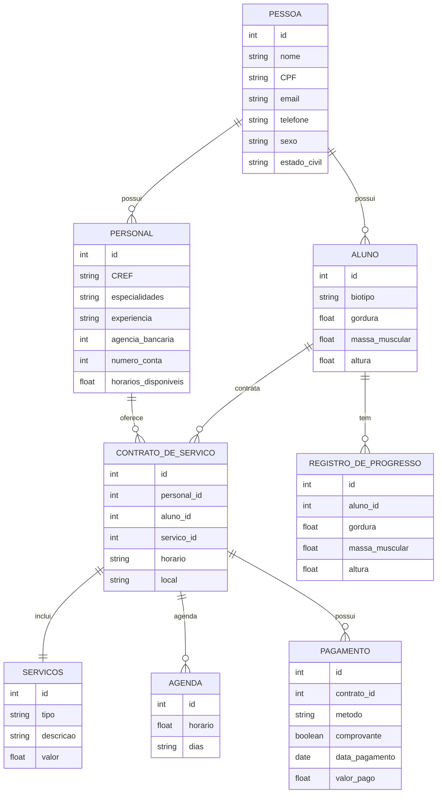

# Documento de Modelos

Modelo conceitual UML e modelo entidade-relacionamento

## Modelo Conceitual

### Diagrama de Classe

      

### Descrição das Entidades

Descrição breve das entidades que o sistema contém.

| Entidade | Descrição   |
|----------|------------------------------------------------------------------------------------------------------------------------------------------------------|
| Personal   | O sistema deverá exigir a entrada, e realizar quando necessário a
consulta, edição, exclusão lógica e física dos dados. |

| Aluno     | O sistema deverá exigir a entrada, e realizar quando necessário a edição,
exclusão lógica e física, dos dados. |

| Pessoa     | Entidade aux.  |

| Servico   | O sistema deverá cadastrar alguns tipos de serviços/pacotes que estarão
pré-preparados para a melhor negociação entre personal e aluno.   |

| Agenda   | Permitir que o personal cadastre no sistema horários disponíveis para
agendamentos de serviços.  |

| Gerar Pagamento   | Capacidade de manter relatórios de pagamentos realizados.       |

| Registro_de_progresso   | Permitir o acompanhamento do progresso dos alunos ao longo do tempo,
registrando medidas corporais, resultados de testes de aptidão física e desempenho
em exercícios. |

| Servicos_de_contrato   | Entidade aux. |

| Contrato_de_servico   | Capacidade de marcar e gerenciar as sessões de treinamento com os
clientes ao longo do tempo.     |

### Modelo de dados (Entidade-Relacionamento)

|   Tabela   | Laboratório |
| ---------- | ----------- |
| Servicos_de_Contrato  | Armazena as informações daquela classe. |

|  Nome         | Descrição                        | Tipo de Dado | Tamanho | Restrições de Domínio |
| ------------- | -------------------------------- | ------------ | ------- | --------------------- |
| servico        | base  | SERIAL       | ---     | PK / Identity |
| contrato         | base    | VARCHAR      | 15      | Unique / Not Null |

---

|   Tabela   | Laboratório |
| ---------- | ----------- |
| Pessoa  | Armazena as informações daquela classe. |

| Nome  | Tipo de Dado | Restrições de Domínio |
| ----- | ------------ | --------------------- |
| id  | SERIAL | PK |
| nome | VARCHAR(150) | NOT NULL |
| RG_CNH | VARCHAR(20) | UNIQUE, NOT NULL |
| CPF | VARCHAR(14) | UNIQUE, NOT NULL |
| dataDeNascimento | DATE | NOT NULL |
| email | VARCHAR(150) | UNIQUE, NOT NULL |
| numeroDeCelular | VARCHAR(15) | NOT NULL |
| sexo | VARCHAR(50) | NOT NULL |
| orientacaoSexual | VARCHAR(50) | --- |
| nomeSocial | VARCHAR(150) | --- |
| etnia | VARCHAR(50) | --- |
| estadoCivil | VARCHAR(50) | --- |

---

|   Tabela   | Laboratório |
| ---------- | ----------- |
| Aluno  | Armazena as informações daquela classe. |

| Nome  | Tipo de Dado | Restrições de Domínio |
| ----- | ------------ | --------------------- |
| id | SERIAL | PK |
| pessoa_id | INT | FK → Pessoa(id) ON DELETE CASCADE |
| status | BOOLEAN | NOT NULL DEFAULT TRUE |
| bioimpedancia | VARCHAR(15) | UNIQUE, NOT NULL |
| altura | FLOAT | NOT NULL |
| idade | INT | NOT NULL |
| sexo | VARCHAR(50) | NOT NULL |
| dataDoExame | DATE | NOT NULL |
| horaDoExame | TIME | NOT NULL |
| aguaCorporalTotal | FLOAT | --- |
| proteinas | FLOAT | --- |
| minerais | FLOAT | --- |
| massaGordura | FLOAT | --- |
| peso | FLOAT | NOT NULL |
| massaMusculaEsqueletica | FLOAT | --- |
| imc | FLOAT | --- |
| pgc | FLOAT | --- |
| taxaMetabolicaBasal | FLOAT | --- |

---

|   Tabela   | Laboratório |
| ---------- | ----------- |
| Personal  | Armazena as informações daquela classe. |

| Nome  | Tipo de Dado | Restrições de Domínio |
| ----- | ------------ | --------------------- |
| id | SERIAL | PK |
| pessoa_id | INT | FK → Pessoa(id) ON DELETE CASCADE |
| status | BOOLEAN | NOT NULL DEFAULT TRUE |
| CREF | VARCHAR(15) | UNIQUE, NOT NULL |
| especialidades | VARCHAR(150) | NOT NULL |
| experienciaProfissional | VARCHAR(250) | --- |
| dadosBancarios | VARCHAR(250) | --- |
| numeroConta | VARCHAR(50) | --- |
| agencia | VARCHAR(50) | --- |
| horariosDisponiveis | TEXT | --- |
| locaisDisponiveis | TEXT | --- |

---

|   Tabela   | Laboratório |
| ---------- | ----------- |
| Servicos  | Armazena as informações daquela classe. |

| Nome  | Tipo de Dado | Restrições de Domínio |
| ----- | ------------ | --------------------- |
| id | SERIAL | PK |
| tipoDeServico | VARCHAR(150) | UNIQUE, NOT NULL |
| descricaoDoServico | TEXT | NOT NULL |
| valorDoServico | FLOAT | NOT NULL |

---

|   Tabela   | Laboratório |
| ---------- | ----------- |
| Agenda  | Armazena as informações daquela classe. |

| Nome  | Tipo de Dado | Restrições de Domínio |
| ----- | ------------ | --------------------- |
| id | SERIAL | PK |
| horariosAgendados | TIME | UNIQUE, NOT NULL |
| dias | VARCHAR(100) | NOT NULL |

---

|   Tabela   | Laboratório |
| ---------- | ----------- |
| Contrato_de_Servico  | Armazena as informações daquela classe. |

| Nome  | Tipo de Dado | Restrições de Domínio |
| ----- | ------------ | --------------------- |
| id | SERIAL | PK |
| personal_id | INT | FK → Personal(id) ON DELETE CASCADE |
| aluno_id | INT | FK → Aluno(id) ON DELETE CASCADE |
| horario_id | INT | FK → Agenda(id) ON DELETE SET NULL |
| servicoDesejado_id | INT | FK → Servicos(id) ON DELETE CASCADE |
| localidadeDesejada | VARCHAR(150) | NOT NULL |

---

|   Tabela   | Laboratório |
| ---------- | ----------- |
| Pagamento  | Armazena as informações daquela classe. |

| Nome  | Tipo de Dado | Restrições de Domínio |
| ----- | ------------ | --------------------- |
| id | SERIAL | PK |
| contrato_id | INT | FK → Contrato_de_Servico(id) ON DELETE CASCADE |
| metodoDePagamento | VARCHAR(50) | NOT NULL |
| comprovanteDePagamento | BOOLEAN | NOT NULL DEFAULT FALSE |
| dataDePagamento | DATE | NOT NULL |
| horaDoPagamento | TIME | NOT NULL |
| valorPago | FLOAT | NOT NULL |

---

|   Tabela   | Laboratório |
| ---------- | ----------- |
| Registro_de_Progresso  | Armazena as informações daquela classe. |

| Nome  | Tipo de Dado | Restrições de Domínio |
| ----- | ------------ | --------------------- |
| id | SERIAL | PK |
| aluno_id | INT | FK → Aluno(id) ON DELETE CASCADE |
| data | DATE | NOT NULL |
| massaGorda | FLOAT | --- |
| massaMagra | FLOAT | --- |
| massaMuscular | FLOAT | --- |
| hidratacao | FLOAT | --- |
| densidadeOssea | FLOAT | --- |
| gorduraVisceral | FLOAT | --- |
| taxaDeMetabolismoBasal | FLOAT | --- |
| altura | FLOAT | NOT NULL |
| peso | FLOAT | NOT NULL |

