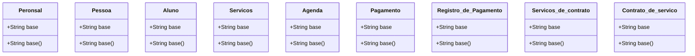

# Documento de Modelos

Modelo conceitual UML e modelo entidade-relacionamento

## Modelo Conceitual

### Diagrama de Classe

      

### Descrição das Entidades

Descrição breve das entidades que o sistema contém.

| Entidade | Descrição   |
|----------|------------------------------------------------------------------------------------------------------------------------------------------------------|
| Personal   | Entidade .                                                  |
| Aluno     | Entidade . |
| Pessoa     | Entidade .                                                                   |
| Servicos   | Entidade .                                                  |
| Agenda   | Entidade .                                                  |
| Pagamento   | Entidade .                                                  |
| Registro_de_Pagamento    | Entidade .  |
| Servicos_de_contrato   | Entidade .                                                  |
| Contrato_de_servico   | Entidade .                                                  |

### Modelo de dados (Entidade-Relacionamento)

|   Tabela   | Laboratório |
| ---------- | ----------- |
| Descrição  | Armazena as informações daquela classe. |

|  Nome         | Descrição                        | Tipo de Dado | Tamanho | Restrições de Domínio |
| ------------- | -------------------------------- | ------------ | ------- | --------------------- |
| base        | identificador gerado pelo SGBD   | SERIAL       | ---     | PK / Identity |
| base         | representação em sigla do lab    | VARCHAR      | 15      | Unique / Not Null |
| base          | nome do laboratório              | VARCHAR      | 150     | Not Null |
| base     | detalhes sobre o laboratório     | VARCHAR      | 250     | --- |