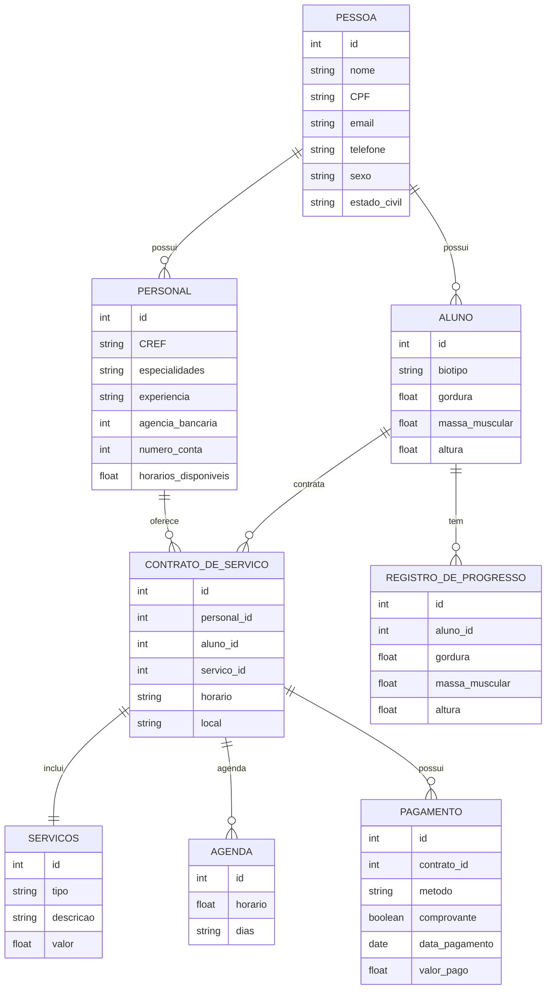

[📌 Link para os Scripts de criação do Banco de Dados](https://github.com/RenanCDev/TraininSync/blob/dev/traininSync-back/scripts/p01/create_script.sql)

[📌 Link para os Scripts de povoamento do Banco de Dados](https://github.com/RenanCDev/TraininSync/blob/dev/traininSync-back/scripts/p01/create_script.sql)

### Modelo de dados (Entidade-Relacionamento)

